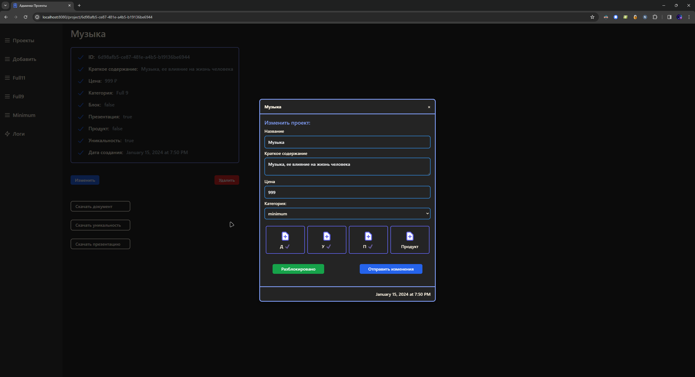

# Project System (Test Task)

Готовая система управления товарами

Перечень программного обеспечения, реализованных в рамках системы:
- API
- Admin panel
- Telegram bot

Технологии, используемые в создание ПО:
- API
    - Python3.10
    - FastAPI
    - Uvicorn
    - SQLite (For test)
    - Loguru
    - JWT token auth
- Admin panel
    - Vite
    - React
- Telegram bot
    - Aiogram
    - Юkassa платежи

Установка репозитория в рабочую директорию:
```bash
git clone https://github.com/Kematin/Telegram-Bots.git && cd Telegram-Bots
mv SellProjectBot path/to/workdir/
cd path/to/workdir/SellProjectBot
```

## API


.env файл:
```bash
ADMIN_USERNAME="admin"
ADMIN_PASSWORD="password"
JWT_SECRET_KEY="secret key"
DATABASE_URL="sqlite+aiosqlite:///./database/db.db"
BOT_SECRET_KEY="secret key"
```
*ADMIN_USERNAME*: Ваше имя админа

*ADMIN_PASSWORD*: Ваш пароль админа

*JWT_SECRET_KEY*: Секретный ключ для шифрования jwt токена

*DATABASE_URL*: Ссылка на реляционную базу данных

*BOT_SECRET_KEY*: Секретный ключ для подлинности запросов бота

Сборка:
```bash
cd projects-api
```

Развертывание:
```bash
cd projects-api
```

## Admin panel

*_[Больше примеров](imgs/admin/)_

Сборка:
```bash
cd admin-client
npm install
npm run dev
```

Развертывание:
```bash
cd admin-client
```

## Telegram bot

*_[Больше примеров](imgs/bot/)_

.env файл:
```bash
BOT_TOKEN=""
SECRET_KEY=""
ADMIN_IP=111111
PROVIDER_TOKEN=""
WEBHOOCK_NGROK=""
```
*BOT_TOKEN*: Токен телеграм бота (BotFather)

*SECRET_KEY* = *BOT_SECRET_KEY* (API)

*ADMIN_IP*: ip телеграма админа (для оправки информации о купленных товарах)

*PROVIDER_TOKEN*: Токен провайдера платежей

*WEBHOOCK_NGROK*: ngrok proxy тунель

Сборка:
```bash
cd sell-projects-bot
```

Развертывание:
```bash
cd sell-projects-bot
```
